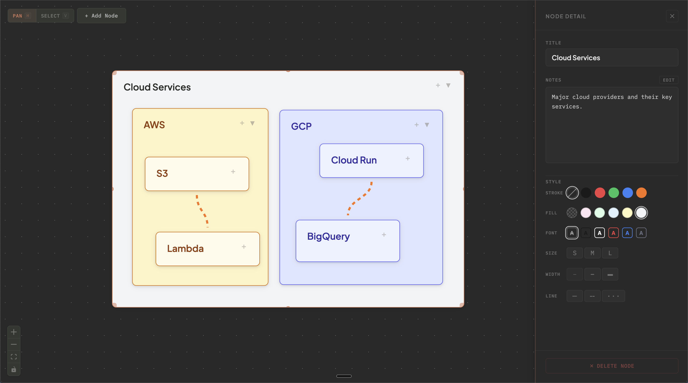
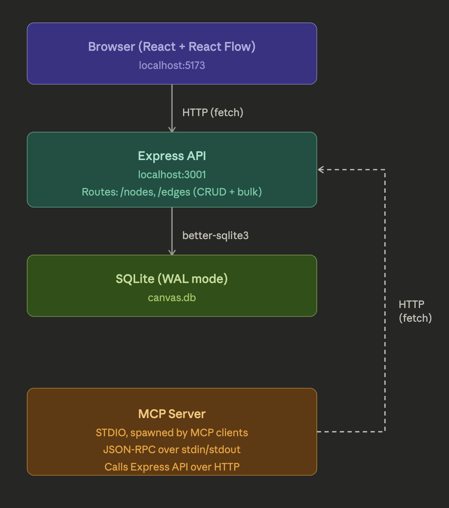

# What is Excalinest?

A spatial canvas for software engineering notes with collapsible, nested nodes. Local-only, backed by SQLite.

Excalidraw is great for drawing but lacks collapsible hierarchy — grouping concepts under a parent, collapsing to hide detail, expanding to drill in. Excalinest adds that.



## Architecture



Three npm workspaces: `server/`, `client/`, `mcp-server/`.

## Quick start

```bash
npm install
npm run dev    # starts server (:3001) + client (:5173)
```

## MCP setup

Build first: `npm run build --workspace=mcp-server`

Add to your Claude Code or Claude Desktop MCP config:

```json
{
  "mcpServers": {
    "knowledge-canvas": {
      "command": "node",
      "args": ["/absolute/path/to/mcp-server/dist/index.js"]
    }
  }
}
```

Tools: `get_canvas`, `search_nodes`, `create_node`, `create_nodes`, `update_node`, `delete_node`, `create_edge`, `delete_edge`, `find_empty_space`, `get_color_palette`

## Keyboard shortcuts

`H` pan | `V` select | `Cmd+C/V` copy/paste | `Delete` remove
